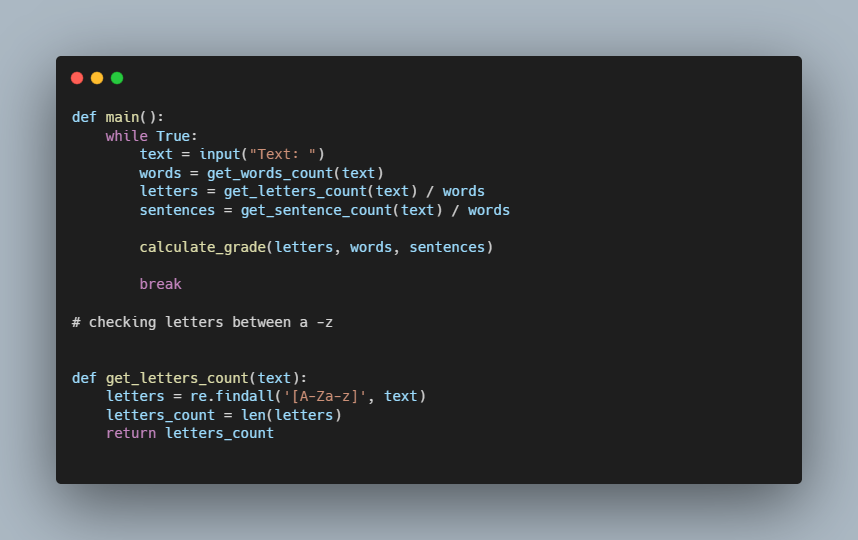

# Readability Python - CS50

### Description

A program that computes the approximate grade level needed to comprehend some text.

The program asks the user to type in some text, and then outputs the grade level for the text,
according to the Coleman-Liau formula.

Coleman-Liau's index is computed as 0.0588 * L - 0.296 * S - 15.8 where L is the average number of letters per 100 words in the text, and S is the average number of sentences per 100 words in the text.

### How to use

python readability.py
Text: (Input any text of your choice)

You will then receive the Grade level: e.g. Grade 3

### Code Snippet

### Links

For more information about Readability visit: 

---------------------------------
[cs50 course](https://cs50.harvard.edu/x/2022/psets/6/readability/)
---------------------------------------------------------------

